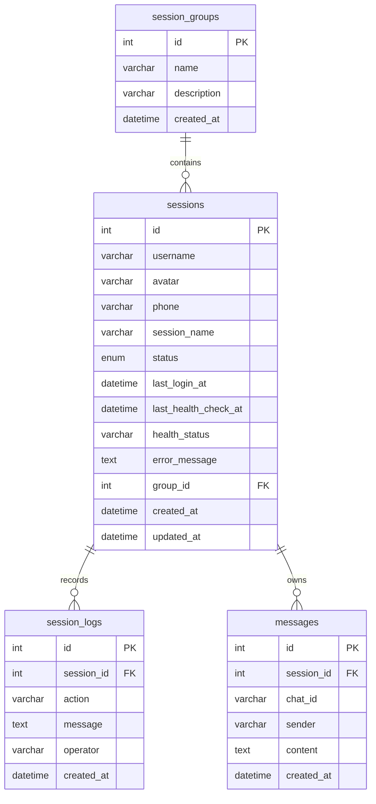

# TG营销管理系统技术需求文档

## 1. 项目概述

TG营销管理系统用于集中管理 Telegram Session、消息、任务和代理资源，支持营销账号状态维护、批量导入、分组、健康检查、操作审计和消息高性能浏览。

核心模块：

- Session管理：账号列表、连接/断开、删除、导入、分组、健康检查、日志。
- 消息管理：分页加载、虚拟滚动展示。
- 任务管理：营销任务扩展入口。
- 代理管理：代理资源扩展入口。

## 2. 技术选型说明

后端：

- FastAPI `0.111.0`：API 和 WebSocket 服务。
- SQLAlchemy `2.0.31`：ORM 和数据库连接池。
- Telethon `1.36.0`：Telegram Session 连接和账号信息获取。
- Redis `5.0.7`：缓存和后续 Pub/Sub 扩展。
- MySQL 8.0：生产数据库。

前端：

- React `18.3.1`
- Vite `5.3.3`
- Ant Design `5.19.1`
- TanStack Query `5.51.1`
- Axios `1.7.2`
- react-window `1.8.10`

部署：

- Ubuntu 22.04
- Nginx 反向代理和静态资源服务
- Uvicorn 后端进程
- systemd / Supervisor / PM2 任选一种进程管理
- Docker Compose 可选容器化部署

## 3. 系统架构设计

数据流：

1. 前端通过 `/api/sessions` 拉取 Session 初始列表。
2. 前端建立一个 `/ws/sessions/all` WebSocket 连接。
3. 用户点击连接 Session，前端调用 `PUT /api/sessions/{id}`，body 为 `{ "action": "connect" }`。
4. 后端更新状态为 `connecting` 并立即推送 WebSocket。
5. Telethon 完成连接验证后，后端更新为 `connected` 或 `error`，再次推送。
6. 前端收到 WebSocket 消息后增量更新 React Query 缓存，页面无需刷新。

逻辑分层：

- `api/`：HTTP 和 WebSocket 路由。
- `schemas/`：请求参数校验。
- `models/`：数据库模型。
- `services/`：业务逻辑、TG连接、日志、导入、健康检查。
- `core/`：配置、数据库、Telegram client、缓存。

## 4. 数据库设计

ER图：



主要索引：

- `sessions.phone` unique
- `sessions.session_name` unique
- `sessions(status, group_id)`
- `session_logs(session_id, created_at)`
- `messages(session_id, created_at)`
- `messages(chat_id, created_at)`

完整初始化 SQL 位于 `deploy/mysql/init.sql`。

## 5. API接口文档

Swagger 地址：

- 本地：`http://127.0.0.1:8000/docs`
- OpenAPI JSON：`http://127.0.0.1:8000/openapi.json`

### GET /api/sessions

查询 Session 列表。

请求参数：

- `group_id`: 可选，按分组过滤。

响应示例：

```json
[
  {
    "id": 1,
    "username": "demo",
    "avatar": null,
    "phone": "+10000000000",
    "session_name": "tg_10000000000",
    "status": "connected",
    "last_login_at": "2026-07-07T12:00:00",
    "health_status": "healthy",
    "group_id": 1,
    "group_name": "主账号"
  }
]
```

### POST /api/sessions

创建 Session。

```json
{
  "username": "demo",
  "phone": "+10000000000",
  "avatar": "https://example.com/avatar.png",
  "session_name": "tg_demo",
  "group_id": 1
}
```

### PUT /api/sessions/{id}

更新、连接或断开 Session。

连接：

```json
{ "action": "connect" }
```

断开：

```json
{ "action": "disconnect" }
```

编辑：

```json
{ "username": "new_name", "group_id": 2 }
```

### DELETE /api/sessions/{id}

删除 Session 和本地 session 文件。

响应：

```json
{ "ok": true }
```

### POST /api/sessions/import

上传 CSV/Excel 批量导入。字段：`username,phone,avatar,group_id`。

响应：

```json
{ "created": 10, "skipped": 2 }
```

### 分组接口

- `GET /api/sessions/groups`
- `POST /api/sessions/groups`
- `POST /api/sessions/move`

移动示例：

```json
{ "session_ids": [1, 2, 3], "group_id": 2 }
```

### 健康检查与日志

- `POST /api/sessions/health-check`
- `GET /api/sessions/logs?session_id=1&limit=100`

### WebSocket

全局 Session 状态：

```text
/ws/sessions/all
```

单个 Session 状态：

```text
/ws/sessions/{id}
```

推送示例：

```json
{
  "event": "status_changed",
  "session": {
    "id": 1,
    "status": "connected",
    "health_status": "healthy"
  }
}
```

### 消息接口

`GET /api/messages?page=1&page_size=100`

消息列表采用分页返回，前端使用 `react-window` 虚拟滚动。

## 6. 前端页面设计

Session管理页面：

- 顶部工具栏：添加、批量导入、新建分组、移动分组、健康检查、操作日志。
- 主表格：用户名、头像、手机号、分组、登录时间、连接状态、健康状态、操作列。
- 操作列：连接、断开、编辑、删除、扩展菜单预留。
- 实时状态：WebSocket 推送后局部更新行数据。

消息页面：

- 顶部加载更多按钮。
- 主体为固定高度虚拟列表。
- 每行展示时间、发送方、内容。

交互说明：

- 添加/编辑使用 Ant Design Modal + Form。
- 删除使用 Popconfirm。
- 日志使用 Drawer。
- 导入使用 Upload，前端不自动上传，由 API 控制。

## 7. 安全方案设计

必须实现：

- JWT 登录认证。
- RBAC 权限控制：管理员、运营、只读。
- WebSocket token 鉴权。
- TG session_string 或 session 文件加密/权限保护。
- 环境变量保存密钥，不提交 `.env`。
- Nginx HTTPS 和安全响应头。
- 操作日志记录 operator、ip、user_agent。

推荐：

- 使用 Alembic 管理迁移。
- Redis Pub/Sub 支持多实例 WebSocket 广播。
- 限制上传文件大小和导入行数。
- 对敏感日志做脱敏。

## 8. 部署方案

文件位置：

- Docker：`backend/Dockerfile`、`frontend/Dockerfile`、`docker-compose.yml`
- Nginx：`deploy/nginx/tg-marketing.conf`
- systemd：`deploy/systemd/tg-marketing-backend.service`
- Supervisor：`deploy/supervisor/tg-marketing-backend.conf`
- PM2：`deploy/pm2/ecosystem.config.cjs`
- 部署脚本：`deploy/deploy.sh`
- 数据库初始化：`deploy/mysql/init.sql`

裸机流程：

1. 安装 Python、Node、Nginx、MySQL、Redis。
2. 执行 `deploy/mysql/init.sql`。
3. 配置 `backend/.env`。
4. 运行 `deploy/deploy.sh`。
5. 使用 certbot 签发 SSL。

Docker 流程：

```bash
cp backend/.env.example backend/.env
docker compose up -d --build
```

## 9. 测试计划

后端：

- API 单元测试：Session CRUD、分组、导入、日志。
- WebSocket 测试：连接成功、断开、删除事件推送。
- Telethon mock 测试：授权成功、未授权、连接异常。
- 数据库测试：唯一键、外键、索引查询。

前端：

- Session 表格渲染。
- 添加/编辑弹窗表单校验。
- WebSocket 消息驱动状态更新。
- 批量导入交互。
- 消息虚拟列表渲染 5000+ 条数据。

性能测试：

- 5000 条消息首屏渲染时间。
- 1000 个 Session 状态增量推送。
- WebSocket 单连接和多连接压力。

安全测试：

- 未授权访问拦截。
- 上传非法文件。
- SQL 注入 payload。
- 敏感日志检查。

## 10. 运维手册

常用命令：

```bash
sudo systemctl status tg-marketing-backend
sudo systemctl restart tg-marketing-backend
sudo journalctl -u tg-marketing-backend -f
tail -f /var/log/tg-marketing/backend.log
tail -f /var/log/nginx/tg-marketing.access.log
```

数据库备份：

```bash
mysqldump -u root -p tg_marketing > tg_marketing_$(date +%F).sql
```

恢复：

```bash
mysql -u root -p tg_marketing < tg_marketing_2026-07-07.sql
```

SSL续期：

```bash
sudo certbot renew --dry-run
```

故障排查：

- 前端空白：检查 Nginx root 是否指向 `frontend/dist`。
- API 502：检查 Uvicorn 进程和 Nginx upstream。
- WebSocket 断开：检查 Nginx `/ws/` Upgrade 配置。
- TG连接失败：检查 `TELEGRAM_API_ID`、`TELEGRAM_API_HASH` 和 session 文件权限。
